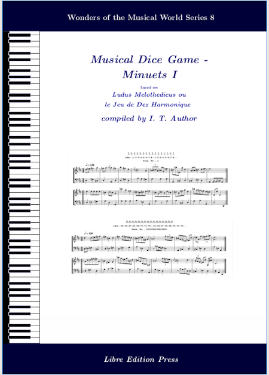

## mdgBookSVG8Kit

[... UNDER CONSTRUCTION ... ]  


**Here's an opportunity for one to "compose" Rondos and to author a Collection Book of such!!!** 

This folder contains materials that allow the user to author a book containing a collection of [Musical Dice Games (MDG)](https://en.wikipedia.org/wiki/Musikalisches_W%C3%BCrfelspiel) minuets, generated based on the rules given in [*Ludus Melothedicus  2nd Ed. (1759)*](https://imslp.org/wiki/Ludus_Melothedicus_(Anonymous)).  

To creat a book, simply [download](https://github.com/justineuro/mdgBookSVG8Kit/archive/main.zip) (or clone: `git clone https://github.com/justineuro/mdgBookSVG8Kit.git`) this project to one's computer, unzip the downloaded archive, and at the command line inside the main folder (`mdgBookSVG8Kit` or `mdgBookSVG8Kit-main` directory) issue the following command (pre-requisites: `bash`, `abcmidi`, `abcm2ps`, `Ghostscript`, `Inkscape`, and `LaTeX`):

```shell
bash HOWTO
```

Wait for a **few** minutes, i.e., until one gets the bash prompt again.  The compiled book in PDF format (`mdgBookSVG8v1.pdf`), among other things, should be located in the `res` folder (subdirectory).  


## For the Impatient
To download and examine an example of a book (`mdgBookSVG8v1.pdf`) that was generated in a similar manner, simply right-click (then "Save Link As ...") on the following image:

[](https://justineuro.github.io/mdgBookSVG8Kit/mdgBookSVG8v1.pdf)

(**Note**: To enable the MIDI audio links in the book, one should download [ldmt-v1-midi.zip](https://justineuro.github.io/mdgBookSVG8Kit/ldmt-v1-midis.zip) and unzip in the same directory in one's computer that contains the book, i.e., the book and midi files have to be in the same directory).


## License
<p xmlns:cc="http://creativecommons.org/ns#" xmlns:dct="http://purl.org/dc/terms/">
    <a property="dct:title" rel="cc:attributionURL" href="https://github.com/justineuro/mdgBookSVG8Kit">mdgBookSVG8Kit</a> by 
    <a rel="cc:attributionURL dct:creator" property="cc:attributionName" href="https://justineuro.github.io/">Justine Leon A. Uro</a> is marked with 
    <a href="https://creativecommons.org/publicdomain/zero/1.0/?ref=chooser-v1" target="_blank" rel="license noopener noreferrer" style="display:inline-block;">CC0 1.0 Universal
        
        
    </a>
</p>