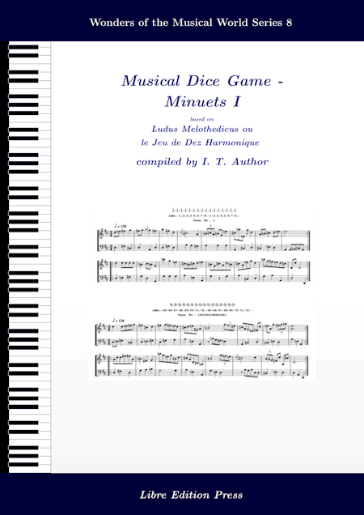

## mdgBookSVG8Kit

[... UNDER CONSTRUCTION ... ]  


**Here's an opportunity for one to "compose" Minuets and to author a Collection Book of such!!!** 

This folder contains materials that allow the user to author a book containing a collection of [Musical Dice Games (MDG)](https://en.wikipedia.org/wiki/Musikalisches_W%C3%BCrfelspiel) minuets, generated based on the rules given in [*Ludus Melothedicus 2nd ed. (1759)*](https://imslp.org/wiki/Ludus_Melothedicus_(Anonymous)).  

To creat a book, simply [download](https://github.com/justineuro/mdgBookSVG8Kit/archive/main.zip) (or clone: `git clone https://github.com/justineuro/mdgBookSVG8Kit.git`) this project to one's computer, unzip the downloaded archive, and at the command line inside the main folder (`mdgBookSVG8Kit` or `mdgBookSVG8Kit-main` directory) issue the following command (pre-requisites: `bash`, `abcmidi`, `abcm2ps`, `Ghostscript`, `Inkscape`, and `LaTeX`):

```shell
bash HOWTO
```

Wait for a **few** minutes, i.e., until one gets the bash prompt again.  The compiled book in PDF format (`mdgBookSVG8v1.pdf`), among other things, should be located in the `res` folder (subdirectory).  


## For the Impatient
To download and examine an example of a book (`mdgBookSVG8v1.pdf`) that was generated in a similar manner, simply right-click (then "Save Link As ...") on the following image:

[](https://justineuro.github.io/mdgBookSVG8Kit/mdgBookSVG8v1.pdf)

(**Note**: To enable the MIDI audio links in the book, one should download [ldmt-v1-midi.zip](https://justineuro.github.io/mdgBookSVG8Kit/ldmt-v1-midis.zip) and unzip in the same directory in one's computer that contains the book, i.e., the book and midi files have to be in the same directory).


## Similar Kits (by the same author) on GitHub
MDG Book kits similar to this may be found on related GitHub sites such as:

- [mdgBookSVGKit](https://github.com/justineuro/mdgBookSVGKit) - MDG based on [*Musikalisches W&uuml;rferspiel, K. 516f*](http://imslp.org/wiki/Musikalisches_W%C3%BCrfelspiel,_K.516f_%28Mozart,_Wolfgang_Amadeus%29), attributed to Wolfgang Amadeus Mozart
- [mdgBookSVG2Kit](https://justineuro.github.io/mdgBookSVG2Kit) - One-Command Kit for Creating MDG Double Counterpoints (Six Measures) Collection Book, the counterpoints are generated based on the rules given in C.P.E. Bach's [*Einfall, einen doppelten Contrapunct in der Octave von sechs Tacten zu machen, ohne die Regeln davon zu wissen*](https://www.jstor.org/stable/843301)
- [mdgBookSVG3Kit](https://justineuro.github.io/mdgBookSVG3Kit) - One-Command Kit for Creating MDG (Kirnberger) Minuet-Trios Collection Book, the minuet-trios are generated based on the rules given in [*Der allezeit fertige Polonoisen- und Menuettencomponist* (*1757*)](https://imslp.org/wiki/Der_allezeit_fertige_Polonoisen-_und_Menuettencomponist_(Kirnberger%2C_Johann_Philipp)) 
- [mdgBookSVG4Kit](https://justineuro.github.io/mdgBookSVG4Kit) - One-Command Kit for Creating MDG Minuet-Trios Collection Book, the minuet-trios are generated based on the rules given in [*Table pour composer des Minuets et des Trios &agrave; la infinie*](http://imslp.org/wiki/Table_pour_composer_des_Minuets_et_des_Trios_%C3%A0_la_infinie_(Stadler,_Maximilian)) (also known as or *Tabelle welcher aus man unzählige Menuetten und Trio für das Klavier herauswürfeln kann* or *Gioco Filarmonico o sia maniera facile per comporre un infinito numero di menuetti e trio, anche senza sapere il contrapunto*) 
- [mdgBookSVG4itKit](https://github.com/justineuro/mdgBookSVG4itKit) - MDG based on [*Gioco Filarmonico o sia maniera facile per comporre un infinito numero di menuetti e trio, anche senza sapere il contrapunto*](http://imslp.org/wiki/Table_pour_composer_des_Minuets_et_des_Trios_%C3%A0_la_infinie_(Stadler,_Maximilian)); similar to  [mdgBookSVG4Kit](https://github.com/justineuro/mdgBookSVG4Kit) but arranged for three (3) instruments
- [mdgBookSVG6Kit](https://justineuro.github.io/mdgBookSVG6Kit) - One-Command Kit for Creating MDG Scottish Dances (Dance-Trios) Collection Book, each dance-trio is generated based on the rules given in [*Kunst, Schottische Taenze zu componiren, ohne musicalisch zu sein*](https://imslp.org/wiki/Kunst%2C_Schottische_Taenze_zu_componiren%2C_ohne_musicalisch_zu_sein_(Gerlach%2C_Gustav))
- [mdgBookSVG7Kit](https://justineuro.github.io/mdgBookSVG7Kit) - One-Command Kit for Creating MDG Rondos Collection Book, each rondo is generated based on the rules given in [_L'art de composer de la musique sans en connaître les éléments - 5th Cahier 2nd Ed. (1802)_](https://s9.imslp.org/files/imglnks/usimg/6/63/IMSLP653334-PMLP1047762-L'Art_de_composer_de_la_-...-Calegari_Antonio_bpt6k9617931c.pdf)


## License
<p xmlns:cc="http://creativecommons.org/ns#" xmlns:dct="http://purl.org/dc/terms/">
    <a property="dct:title" rel="cc:attributionURL" href="https://github.com/justineuro/mdgBookSVG8Kit">mdgBookSVG8Kit</a> by 
    <a rel="cc:attributionURL dct:creator" property="cc:attributionName" href="https://justineuro.github.io/">Justine Leon A. Uro</a> is marked with 
    <a href="https://creativecommons.org/publicdomain/zero/1.0/?ref=chooser-v1" target="_blank" rel="license noopener noreferrer" style="display:inline-block;">CC0 1.0 Universal
        
        
    </a>
</p>